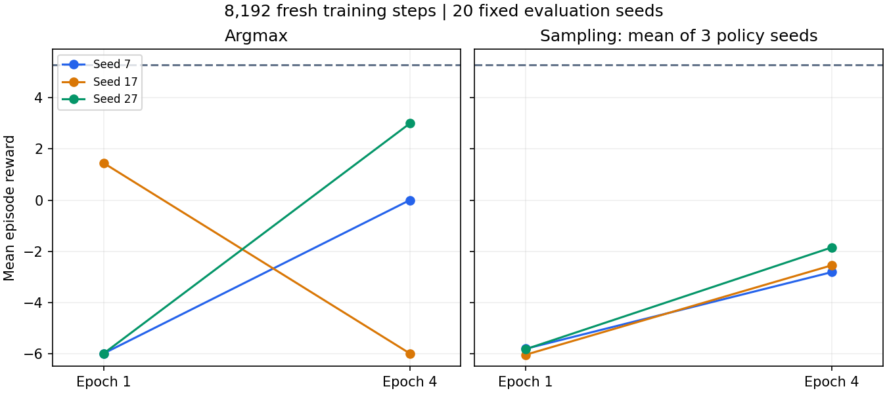

# PPO 반복 학습 횟수 비교 결과

2026-09-05 기존8192스텝·학습 seeds7/17/27에서 n_epochs만1→4로 변경했다. Grok Bot의 기존 Linux CPU 환경에서 신규 학습3회와 초기/최종 평가480게임을 완료했다. **확률적 선택은 세 seed 모두 개선돼 epoch4를 후속 검증 후보로 삼는다.** 결정적 선택은 한 seed에서 악화됐으며, 휴리스틱 기준에는 미달한다.

## 같은 조건의 비교

각 argmax 값은 고정 게임 seeds201–220의20게임 평균이다. 확률적 선택은 같은 게임 seeds와 정책 seeds11/22/33의60게임 평균이다. 기존 epoch1 baseline은006 원본을 사용했다. 세 학습 seed를 독립 반복으로 취급하고 평가게임 수를 학습 반복 수로 세지 않는다.

| 학습 seed | argmax 보상 epoch1→4 | 확률적 선택 보상 epoch1→4 | 확률적 생존율 epoch1→4 | 학습 함수 시간 epoch1→4 |
| --- | --- | --- | --- | --- |
| 7 | -6.00 → 0.00 | -5.817 → -2.817 | 0% → 71.67% | 5.839 → 8.147초 |
| 17 | +1.45 → -6.00 | -6.050 → -2.550 | 0% → 70.00% | 5.729 → 7.784초 |
| 27 | -6.00 → +3.00 | -5.833 → -1.850 | 0% → 83.33% | 5.923 → 7.667초 |
| 세 seed 평균 | -3.517 → -1.000 | -5.900 → -2.406 | 0% → 75.00% | 5.831 → 7.866초 |

업데이트 수는256→1024, 평균 학습 함수 시간은 약34.9% 늘었다. 동일 데이터 수에서 더 많은 계산을 사용한 비교이며 계산량을 맞춘 비교는 아니다. 과거 동일 평가 조건의 휴리스틱은 보상+5.30, 생존율100%였다.

행동 낭비에는 차이가 남는다. epoch4 argmax에서 seed7은 동결89.58%·강제 턴 종료160회, seed17은 동결100%·강제 종료120회다. seed27은 동결0%·강제 종료0회이고 보상+3.00을 얻었다. 확률적 선택에서도 seed17은 동결 약75.41%이며 평균 강제 종료143.33회/20게임이다. 보상·생존율 개선만으로 행동 반복 문제가 해결됐다고 보지 않는다.

## 구현과 검증

- `../scripts/learning_curve.py`에 명세의 `n_epochs`를 추가했다. 생략하면 기존1이며1/4만 허용한다. 학습 설정 생성 함수로 epoch 외 조건이 같은지 검증한다.
- `../tests/test_learning_curve.py`에 단일 설정 변경·입력 검증을 추가했다. 관련 로컬14테스트 통과(6.81초), 클라우드14테스트 통과(2.22초), Ruff 통과.
- `../handoff/epoch-007/run_007.py`는 기존 Linux venv와 파일 해시·출력 부재를 확인한 뒤 전달된 감독 명세를 실행한다. 테스트→Ruff→학습·평가 순서다. 이번 반환 로그에는 진입기1회·exit0·빈 stderr·자연 종료가 기록됐고 재시도나 수리 이력은 없다.
- 감독기 전체51.239초, 학습·평가 프로세스47.862초, 최대 샘플링 RSS408,866,816bytes. 각 학습60초/전체180초, CPU intraop/interop1, RSS2GiB 안에서 완료했다. 잔여 PID는 없다.
- 실행 종료 시 디스크 증가35,196,942bytes,100MiB 미만. RSS·디스크는 샘플링/측정 시점의 값이며 하드 상한 보장이 아니다.
- 전후 패키지8파일과 snapshot-003의44파일 검증 결과가 일치한다. 기존003/005/006 소스·모델을 보존했다.
- Codex가 원본 ZIP을 다시 검사했다. 세 모델의 설정은 baseline과 비교해 n_epochs만 다르고, 초기 에피소드뿐 아니라 전체 행동 확률 trace도 정확히 일치했다. 최종 모델 내부 스텝8192·업데이트1024, 모델 해시,480게임의 합법 액션·확률·엔트로피·보상 합·승률·생존율·요약을 검증했다. 모델 pickle을 로드하거나 로컬 재학습하지 않았다.
- 과거005/006 감사 스크립트는 최신 개발 파일 대신 당시 전달 ZIP의 고정 실행기 해시를 비교하도록 수정했고, 기존1,440게임 감사도 다시 통과했다.

## 원본 증거

- 전달: `../handoff/epoch-007/epoch-007.zip`,10,401bytes, SHA256 `3bd624f628c4ac2e258404c9f0be6605990ea053529b2e9145da3881902af042`.
- 반환: `../handoff/epoch-007/grok-epoch-007.zip`,6,470,785bytes, SHA256 `c16ac17332d9fd1ef0cbc16293791b07fc208b2d4d4b4d14033b0c6a4c28bade`.
- 재계산: `../handoff/epoch-007/audit-007.json`.
- 재현 명령: 프로젝트 루트에서 `python handoff/epoch-007/audit_007.py c16ac17332d9fd1ef0cbc16293791b07fc208b2d4d4b4d14033b0c6a4c28bade`.
- 실험 명세: `../experiments/EPOCH_COMPARISON_007.md`. 그래프 내보내기: `epoch-comparison-007.svg`.

## 다음 단계

추가 튜닝 전에 epoch1과4의 기존 여섯 모델을 **새로운 고정 평가 seed와 별도 상대 구성**에서 비교한다. 학습 없이 개선이 재현되는지 확인하는 단계다. 특정 seed27 모델만 고르지 않고 세 학습 seed를 모두 평가한다. 조건을 평가 전에 고정하고, 생존·보상과 행동 낭비를 함께 판정한다.

현재 결과는 반복 사용한20게임 seed·작은 고정 상대 환경에서의 후보 선택 근거다. 새 검증 세트의 개선이나 실제 하스스톤 전장 성능은 아직 확인하지 않았다. 기본 smoke 설정은 바꾸지 않았다.
