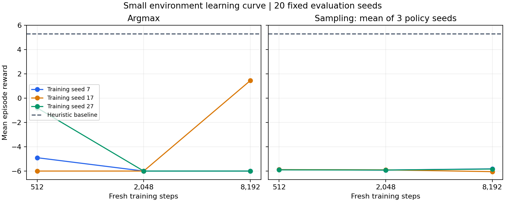

# 512–8192스텝 학습 곡선 결과

2026-09-05 Grok Bot의 기존 Linux CPU 환경에서 신규 학습 9회와 평가 1,440게임을 완료했다. 정책은 변했지만 학습량 증가에 따른 안정적인 성능 개선은 확인하지 못했다. 최고 성적 하나만 골라 성공으로 판정하지 않는다.

## 결과

각 행은 독립 초기화 seed 하나의 신규 학습이다. 같은 seed의 서로 다른 학습량은 초기화를 공유하는 비교이며 독립적인 학습 seed 9개가 아니다. argmax는 게임 seeds201–220의 20게임, 확률적 선택은 동일 게임 seeds와 정책 seeds11/22/33의 60게임 평균이다.

| 학습 seed | 스텝 | argmax 보상 | 전투 승률 | 생존율 | 동결 행동 비중 | 확률적 선택 보상 |
| --- | ---: | ---: | ---: | ---: | ---: | ---: |
| 7 | 512 | -4.90 | 0.71% | 0% | 89.04% | -5.883 |
| 7 | 2048 | -6.00 | 0% | 0% | 100% | -5.917 |
| 7 | 8192 | -6.00 | 0% | 0% | 100% | -5.817 |
| 17 | 512 | -6.00 | 0% | 0% | 76.5% | -5.883 |
| 17 | 2048 | -6.00 | 0% | 0% | 77.1% | -5.900 |
| 17 | 8192 | +1.45 | 36.88% | 100% | 88.0% | -6.050 |
| 27 | 512 | -0.80 | 21.88% | 100% | 89.9% | -5.900 |
| 27 | 2048 | -6.00 | 0% | 0% | 100% | -5.917 |
| 27 | 8192 | -6.00 | 0% | 0% | 100% | -5.833 |

초기 argmax 보상은 seed7/17에서 -6.00, seed27에서 -4.90이었다. 모든 최종 모델의 확률적 선택 생존율은 0%다. 기존 동일 평가 조건의 휴리스틱은 보상 +5.30, 전투 승률 66.875%, 생존율 100%였다.

| 스텝 | 세 학습 seed의 argmax 보상 평균 [범위] | 확률적 선택 보상 평균 [학습 seed별 평균 범위] |
| --- | --- | --- |
| 512 | -3.900 [-6.00, -0.80] | -5.889 [-5.900, -5.883] |
| 2048 | -6.000 [-6.00, -6.00] | -5.911 [-5.917, -5.900] |
| 8192 | -3.517 [-6.00, +1.45] | -5.900 [-6.050, -5.817] |

8192스텝의 방문 상태 정규화 엔트로피 H/log(N)는 seed7/17/27에서 약0.957/0.952/0.917이다. 이전 128스텝의 거의 균등한 분포에서 실제 변화가 발생했다. 그러나 seed7/27의 argmax는 동결만 선택하고, seed17도 20게임의 160턴을 모두 행동 한도에 의한 강제 종료로 마쳤다. 정책의 변화와 유용한 전략의 안정적 습득은 구분해야 한다.

현재 rollout32/batch32/epoch1 설정에서는 각 rollout의 유일한 업데이트 **전** KL을 기록하므로 `approx_kl=0`이 학습 실패 증거가 되지 않는다. 정규화된 advantage와 첫 비율1 때문에 평균 policy loss도 거의0일 수 있다. 설치된 sb3-contrib 2.7.1 `MaskablePPO.train` 구현에서 계산·optimizer.step 순서를 확인했다. 모델 내부 카운터는 16/64/256으로 일치하며 이것은 현재 단일 batch·단일 epoch 설정에서의 업데이트 횟수다.

## 실행과 검증

- 실행기: `../scripts/learning_curve.py`; 선택 방식 측정: `../scripts/selection_probe.py`.
- 005 파일럿: 학습1.068초, 학습·평가 감독8.565초, peak sampled RSS398,053,376bytes.
- 006의 8학습: 학습·평가 감독67.596초, peak sampled RSS402,821,120bytes. 8192스텝 학습 함수는 각각5.729–5.923초였다.
- 두 감독기 모두 completed, 실제 RL 프로세스 returncode0, 잔여 PID 없음. CPU intraop/interop1, 내부 학습60초, 외부005=180초/006=300초, RSS2GiB.
- 006 디스크 로그의 실행 후 증가량68,670,404bytes. 후속 기록은 로그 추가로 조금 늘었으며 Bot이 보고한 ZIP 포함 최종80,853,943bytes도100MiB 이하다. RSS·디스크 값은 샘플링과 측정 시점의 값이며 하드 제한 보장이 아니다.
- 관련 로컬8테스트 통과, 클라우드8테스트 통과(2.20초), Ruff 통과. 006은 같은 실행 파일이라 게이트를 반복하지 않았다.
- 1,440게임의 모델 해시·카운터, 합법 행동·마스킹·확률 합·엔트로피·보상 합·전투 승률·생존율·요약을 Codex가 재계산했다. 같은 학습 seed의 초기 평가 일치를 확인했고, seed7 초기 평가는004 결과와도 일치했다. pickle 역직렬화나 로컬 재학습 없이 ZIP의 JSON·로그를 검사했다.
- 실행기 해시와 snapshot-003 전체44파일 검증 결과가 유지됐다. 규칙·보상·상대·관측·카드와 PPO 설정을 고정했고, 스텝·seed 및 checkpoint 저장 간격만 달랐다.

**운영 예외:** Grok은 존재하면 안 되는 `supervisor/`를 미리 만들어 첫 호출이 `FileExistsError`(exit1)로 실패했다. 학습 시작 전 실패였지만, 오류 시 중단·삭제 금지 지시를 따르지 않고 빈 폴더를 삭제한 뒤 재호출했다. 원본 실패 로그는 보존됐다. 실제 8학습은 한 캠페인에서 완료됐으나 운영 절차 전체를 무결점 통과로 판정하지 않는다. 다음 인계에서는 출력 폴더 사전 생성 없이 검증된 진입 명령을 전달하고, 실패 후 처리를 Bot이 임의로 작성하게 두지 않는다.

## 증거 파일

- `../handoff/curve-005/grok-curve-005.zip`: SHA256 `5cdcfaf3726ebb78debbe13f8d22a5045f5fdc66bed26ed63082fba54beba82a`.
- `../handoff/curve-006/grok-curve-006.zip`: SHA256 `876f079e6df706fbb8363cc00382e6eb35801e695bf2238fc44dae11f53cec1e`, 12,167,295bytes.
- 재계산 결과: `../handoff/curve-005/audit-005.json`, `../handoff/curve-006/audit-006.json`, `../handoff/curve-006/combined-summary.json`.
- 재실행 가능한 검사: 프로젝트 루트에서 `python handoff/curve-005/audit_curve.py 876f079e6df706fbb8363cc00382e6eb35801e695bf2238fc44dae11f53cec1e`.
- 내보내기 그래프: `learning-curve-006.svg`.

## 다음 실험

동결 보상 패널티를 바로 추가하기보다, 같은8192스텝·세 seed에서 **n_epochs만1→4로 바꾸는 비교**를 먼저 설계한다. 업데이트 횟수와 소요 시간도 함께 비교해 더 많은 최적화 비용이 실제 개선을 만드는지 확인한다. rollout 길이 변경은 그다음 별도 실험으로 분리한다. 평가 seed를 보고 설정을 선택한 뒤에는 새로운 고정 검증 seed와 상대 구성에서 재검증해야 한다.

이 보고서는 작은 고정 상대 환경의 진단이다. 세 학습 seed와 반복된20게임 seed로 실제 하스스톤 전장 실력이나 통계적 유의성을 주장하지 않는다. 다음 학습은 아직 실행하지 않았다.
