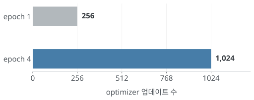
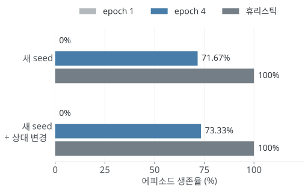
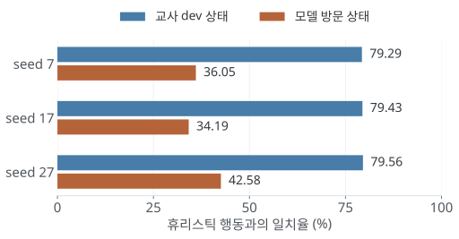
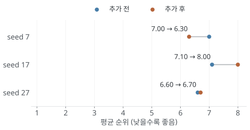

하스스톤 전장을 플레이하는 AI를 만들어 보려고 한다.<br/>
게임 환경을 직접 구현하고, 그 안에서 기물 구매와 배치 등의 행동을 학습하도록 구성했다.

아직 실제 전장을 플레이할 수 있는 단계는 아니다. 이번 포스팅에서는 기존 구현을 다시 만든 이유와 지금까지 진행한 학습 실험을 정리하려고 한다.

세부 코드는 아래에서 확인할 수 있다.<br/>
[GitHub - hearthstone-battleground](https://github.com/KIMMUSIC/hearthstone-battleground)

---

## [주제 선정]

전장에서는 같은 골드로 기물을 구매할 수도 있고, 리롤하거나 다음 턴을 준비할 수도 있다. 지금 보드를 강하게 만드는 선택이 최종 순위에도 유리한지는 바로 알기 어렵다.

이런 선택을 강화학습으로 다뤄보고자 했다. 특히 나중에 얻은 보상을 앞선 행동에 어떻게 반영할지, 즉 **credit assignment**를 직접 실험하기에 적합하다고 봤다.

| 전장의 특징 | 학습에서 다룰 문제 |
| --- | --- |
| 행동 직후에는 최종 순위를 모름 | 지연 보상, 가치 추정 |
| 상점 결과와 상대의 다음 선택을 모름 | 확률적 전이, 부분 관측 |
| 학습할 때와 다른 상대를 만남 | 상대 분포 변화에 대한 일반화 |

처음부터 모든 카드를 구현하기보다는, 작은 환경에서 학습과 평가가 제대로 되는지 확인한 뒤 범위를 넓히는 방향으로 진행하고 있다.

## [기존 구현의 문제]

처음에는 Python에서 학습하고 C# 시뮬레이터와 gRPC로 통신하도록 만들었다. 당시 기록에는 약 50만 스텝 학습 후 평균 보상이 **−15.3에서 49.0**으로 올라갔다고 남아 있다.

그런데 코드를 다시 확인해 보니 이 결과를 그대로 믿기는 어려웠다.

| 확인한 문제 | 학습 결과에 미치는 영향 |
| --- | --- |
| 서로 다른 전투의 함성·죽음의 메아리를 공통 버프로 처리 | 실제 카드 효과와 다른 환경의 정책을 학습함 |
| Python의 seed가 C# 서버로 전달되지 않음 | 같은 조건으로 실험을 다시 실행하기 어려움 |
| 현재 보드를 공유 ghost pool에 넣은 직후 상대를 추출 | 자기 보드가 상대가 되거나 실행 이력에 따라 상대가 달라질 수 있음 |

이 상태에서는 보상이 오른 이유가 전략을 배웠기 때문인지, 단순화한 규칙에 적응했기 때문인지 구분하기 어렵다. 그래서 기존 코드는 참고용으로 남기고 학습 환경부터 다시 만들었다. 위 보상 수치는 당시 기록이며 이번에 재현한 결과는 아니다.

## [학습 환경]

Rebuild에서는 Python 엔진과 Gymnasium 환경을 분리했다. 통신 계층을 줄여 규칙과 학습 코드를 같은 환경에서 확인할 수 있게 했다.

<div class="flow" role="img" aria-label="게임 엔진에서 관측과 행동 마스크를 만들고 정책이 행동을 선택하면 엔진이 보상을 반환한다.">
<div><b>게임 엔진</b><span>상점 · 경제 · 전투</span></div><i>→</i><div><b>Gymnasium</b><span>관측 · 행동 마스크</span></div><i>→</i><div><b>정책 네트워크</b><span>행동 선택</span></div>
<p>선택한 행동을 실행 → 보상과 다음 관측 반환 → rollout에 저장</p>
</div>

현재 지원 범위는 **상점 카드 7종, 소환 토큰 1종, 2티어**다. 구현하지 않은 효과가 있는 카드는 학습 풀에서 제외했다. 카드 수를 늘리기 전에 전투 이벤트 순서와 구매·판매 등의 규칙을 테스트하고 있다.

학습 상대와 평가 상대도 분리했다. 모델을 저장할 때 코드·카드 데이터·매핑·환경 설정의 서명을 함께 남겨, 규격이 다른 환경에서 이전 모델을 그대로 불러오지 않도록 했다.

[규칙 명세](https://github.com/KIMMUSIC/hearthstone-battleground/blob/main/docs/RULES.md) · [환경 구현](https://github.com/KIMMUSIC/hearthstone-battleground/blob/main/src/hearthstone_ai/env.py)

## [PPO 학습]

알고리즘은 **MaskablePPO**를 사용했다. 골드가 부족한데 기물을 구매하는 것처럼 불가능한 행동은 action mask로 제외한다. 남은 행동의 확률 분포에서 행동을 선택한다.

정책은 작은 MLP로 시작했다. 현재 관측을 사용하는 feed-forward 구조이며, 과거 관측을 기억하는 recurrent policy는 아직 사용하지 않는다.

### 학습 설정

아래는 작은 고정 상대 환경에서 사용한 설정이다. 뒤에서 설명할 8인 로비 모방 학습과는 별도 실험이다.

```python
# training.py의 모델 생성 부분 중 주요 설정
model = MaskablePPO(
    "MultiInputPolicy", env,
    n_steps=32, batch_size=32, n_epochs=4,
    gamma=0.99,
    policy_kwargs={"net_arch": [32, 32]},
    seed=7, device="cpu",
)
```

`n_steps=32`는 **32경기**가 아니라, 업데이트 전에 수집할 **환경 전이 32개**를 의미한다. 이 rollout에서 가치 함수와 GAE를 이용해 advantage를 계산하고, 정책과 가치 함수를 갱신한다.

PPO는 이전 정책과 현재 정책의 행동 확률 비율을 사용한다. Advantage가 양수인 행동의 확률을 높이되, clipped objective로 과도한 변경의 유인을 줄인다. Clipping이 KL divergence의 상한을 보장하는 것은 아니다.

<details>
<summary>Policy loss와 advantage</summary>
<div class="formula">rₜ(θ) = πθ(aₜ | oₜ) / πold(aₜ | oₜ)<br/>Lclip = E[min(rₜ Âₜ, clip(rₜ, 1−ε, 1+ε) Âₜ)]</div>
<p>위 식은 최대화하는 정책 목적함수다. 실제 구현에서는 부호를 바꾼 policy loss와 value loss 등을 사용한다. Â는 해당 행동 이후의 결과가 가치 함수의 예상보다 얼마나 좋았는지를 추정한 값이며 GAE로 계산한다.</p>
<p>부분 관측 문제를 완전히 해결한 모델은 아니다. 현재 정책 입력 oₜ는 공개 상태를 인코딩한 관측이며, 숨겨진 상대 정보를 정답처럼 넣지 않는다.</p>
<p><a href="https://arxiv.org/abs/1707.06347">PPO 논문</a> · <a href="https://sb3-contrib.readthedocs.io/en/master/modules/ppo_mask.html">MaskablePPO 문서</a></p>
</details>

### 스텝 수와 업데이트 수

처음에는 학습 스텝을 512 → 2,048 → 8,192로 늘려봤다. 일부 seed의 성적은 좋았지만, 다른 seed에서는 동결만 반복하는 정책이 나왔다. 스텝을 늘리는 것만으로 안정적인 개선은 확인하지 못했다.

그래서 다음에는 환경 스텝을 **8,192로 고정**하고 `n_epochs`만 1에서 4로 변경했다.



<p class="caption">단일 환경, rollout 32, batch 32 기준. 8,192 ÷ 32 × epoch = optimizer 업데이트 수. 그래프를 누르면 크게 볼 수 있다.</p>

한 rollout을 한 번 학습하던 것을 네 번 사용하도록 바꾼 것이다. 환경에서 얻는 샘플 수는 같지만 최적화 연산은 더 많다. 실제 평균 학습 시간도 **5.831초 → 7.866초**로 늘었다.

<details>
<summary>학습 로그에서 approx_kl=0이 나왔던 이유</summary>
<p>초기 설정은 rollout32 / batch32 / epoch1이었다. 이 경우 rollout마다 유일한 업데이트 직전에 KL을 기록한다. 아직 가중치를 바꾸기 전이므로 현재 정책과 rollout을 수집한 정책이 같아 approx_kl이 0으로 나올 수 있다.</p>
<p>Advantage 정규화와 초기 확률 비율 1 때문에 평균 policy loss도 0에 가까울 수 있다. Loss의 값이 0에 가깝다고 gradient까지 0이라는 뜻은 아니다. 이 실험에서는 설치된 sb3-contrib 2.7.1의 계산 순서와 optimizer 업데이트 카운터, 행동 확률을 같이 확인했다.</p>
<p><a href="https://github.com/KIMMUSIC/hearthstone-battleground/blob/main/docs/LEARNING_CURVE_RESULT_006.md">학습 곡선 및 로그 분석 기록</a></p>
</details>

[학습 코드](https://github.com/KIMMUSIC/hearthstone-battleground/blob/main/src/hearthstone_ai/training.py) · [학습 설정](https://github.com/KIMMUSIC/hearthstone-battleground/blob/main/configs/research_train.json) · [epoch 비교 기록](https://github.com/KIMMUSIC/hearthstone-battleground/blob/main/docs/EPOCH_COMPARISON_RESULT_007.md)

## [학습 결과]

Epoch 4에서는 기존 개발 평가의 생존율이 0%에서 75%로 올랐다. 같은 평가 세트를 보고 설정을 골랐기 때문에, 사용하지 않았던 게임 seed와 변경된 상대 구성에서도 평가했다.



<p class="caption">확률적 행동 선택. 모델 막대당 3 학습 seed × 3 행동 선택 seed × 20 게임 seed = 180회, 휴리스틱은 조건당 20회. 두 조건은 같은 20개 게임 seed를 공유한다.</p>

새 seed에서는 **71.67%**, 상대 구성을 바꾼 조건에서는 **73.33%**로 개선이 유지됐다. 다만 휴리스틱은 두 조건 모두 100%였다. 학습 설정 변경의 효과는 있었지만, 직접 작성한 규칙 기반 정책을 넘은 것은 아니다.

여기서 생존율은 작은 고정 상대 환경의 에피소드 종료 시 생존 비율이다. 실제 전장 승률이나 8인 로비의 상위 4위 비율과는 다른 지표다. 학습 seed도 세 개이므로 이 결과만으로 일반화를 판단하기는 어렵다.

[평가 결과와 실험 조건](https://github.com/KIMMUSIC/hearthstone-battleground/blob/main/docs/HOLDOUT_RESULT_008.md)

## [8인 로비와 모방 학습]

이후 공유 카드 풀과 탈락 처리가 있는 제한된 8인 로비를 구현했다. 이 환경에서는 PPO 성능이 휴리스틱보다 낮았다. 그래서 현재 관측으로 휴리스틱의 선택을 배울 수 있는지 **Behavior Cloning(행동 모방)**으로 먼저 확인했다.

교사가 선택한 행동의 negative log-likelihood를 줄이도록 학습한다. 이 단계에서는 critic을 고정하고 actor 쪽 가중치만 갱신했다.

```python
# lobby_imitation.py 중 loss 계산 부분
distribution = model.policy.get_distribution(obs, action_masks=masks)
loss = -distribution.log_prob(actions).mean()
```

### 개발 정확도와 실제 플레이의 차이

행동 종류의 불균형을 보정한 모델은 교사 개발 데이터에서 약 79%의 일치율을 보였다. 그런데 모델을 직접 플레이시켜 방문한 상태에서 다시 확인하니 일치율이 크게 떨어졌다.



<p class="caption">실험 044. 교사 dev는 각 모델 2,236행. 방문 상태는 seed7/17/27 각각 1,373/1,436/1,529행이며, 서로 같은 상태의 비교는 아니다.</p>

교사의 경로에서 잘 따라 하더라도, 모델이 한 번 다른 행동을 하면 이후에는 다른 상태를 만나게 된다. **교사와 학습 정책의 state distribution 차이**를 확인할 필요가 있었다. 위 격차가 원인을 확정해 주지는 않지만, 개발 데이터 정확도만 봐서는 부족하다는 점은 확인할 수 있었다.

### 모델이 방문한 상태를 추가한 결과

학습용 seed에서 모델이 직접 플레이한 상태를 수집하고, 같은 상태에 대한 휴리스틱의 행동을 label로 붙였다. 개발 평가 데이터는 추가하지 않았다.

| 항목 | 설정 |
| --- | --- |
| 기본 교사 데이터 | 10,752행 |
| 추가 방문 상태 | 모델 seed별 약 7,300행, 총 300경기 수집 |
| 모델 / batch | MLP 32×32 / 64 |
| 최적화 | Adam, learning rate 0.0003, gradient norm clip 0.5 |
| 학습 예산 | 모델당 1,024 지도 업데이트, PPO 스텝 0 |



<p class="caption">실험 045. 각 점은 같은 개발 평가 seed 20경기의 평균. 낮을수록 좋다. 휴리스틱은 같은 평가에서 평균 4.25위였다.</p>

결과는 **평균 6.90위 → 7.00위**로 오히려 나빠졌다. 개선된 seed도 세 개 중 하나라 이 후보는 채택하지 않았다.

추가 분석에서는 2/3 seed에서 방문 상태의 학습 정확도가 오르는 동안 기본 교사 상태의 정확도가 떨어졌다. 데이터를 추가해도 두 출처의 행동을 모두 잘 학습하는 것은 아니었다. 다만 이것은 학습 데이터의 정확도 변화이며 경기 성능 개선과는 별도로 봐야 한다.

[모방 학습 구현](https://github.com/KIMMUSIC/hearthstone-battleground/blob/main/src/hearthstone_ai/lobby_imitation.py) · [방문 상태 진단](https://github.com/KIMMUSIC/hearthstone-battleground/blob/main/experiments/diagnostics/lobby044_visited_states.json) · [방문 데이터 추가 실험](https://github.com/KIMMUSIC/hearthstone-battleground/blob/main/experiments/LOBBY_045_VISITED_TRAINING.md)

## [다음 작업]

다음에는 같은 데이터와 업데이트 횟수를 유지하고, batch64를 **기본 교사 상태 48개 + 추가 상태 16개**로 구성해서 비교하려고 한다. 데이터 양을 더 늘리기 전에 sampling 비중이 결과를 바꾸는지 확인하는 실험이다.

<div class="quota" role="img" aria-label="다음 실험의 batch 구성: 기본 교사48개, 추가 방문 상태16개"><span>기본 교사 48</span><span>추가 16</span></div>

후보는 평균 순위 0.5위 이상 개선, 개선 seed 2/3 이상, 모든 후보의 교사 dev 정확도 75% 이상을 만족해야 한다. 상위 4위 비율이 감소하지 않고 제한 중단도 없어야 한다. 이 실험은 아직 실행하지 않았다.

현재는 카드 확대보다 제한된 환경에서 정책이 왜 실패하는지 확인하는 데 집중하고 있다. 이후 학습과 평가가 안정되면 검증된 카드 효과와 상대 구성을 조금씩 늘릴 예정이다.

[다음 실험 명세](https://github.com/KIMMUSIC/hearthstone-battleground/blob/main/experiments/LOBBY_047_SOURCE_MIX.md) · [개발 계획](https://github.com/KIMMUSIC/hearthstone-battleground/blob/main/docs/DEVELOPMENT.md)

---

## [링크]

- [GitHub Repository](https://github.com/KIMMUSIC/hearthstone-battleground)
- [규칙과 지원 범위](https://github.com/KIMMUSIC/hearthstone-battleground/blob/main/docs/RULES.md)
- [학습 코드](https://github.com/KIMMUSIC/hearthstone-battleground/blob/main/src/hearthstone_ai/training.py)
- [모방 학습 코드](https://github.com/KIMMUSIC/hearthstone-battleground/blob/main/src/hearthstone_ai/lobby_imitation.py)

<p class="caption">2026-09-06 기준. 저장소의 일부 결과 문서에 있는 10월 날짜는 작업 순서 표기다. 현재 코드와 실험 기록을 기준으로 작성했다.</p>
